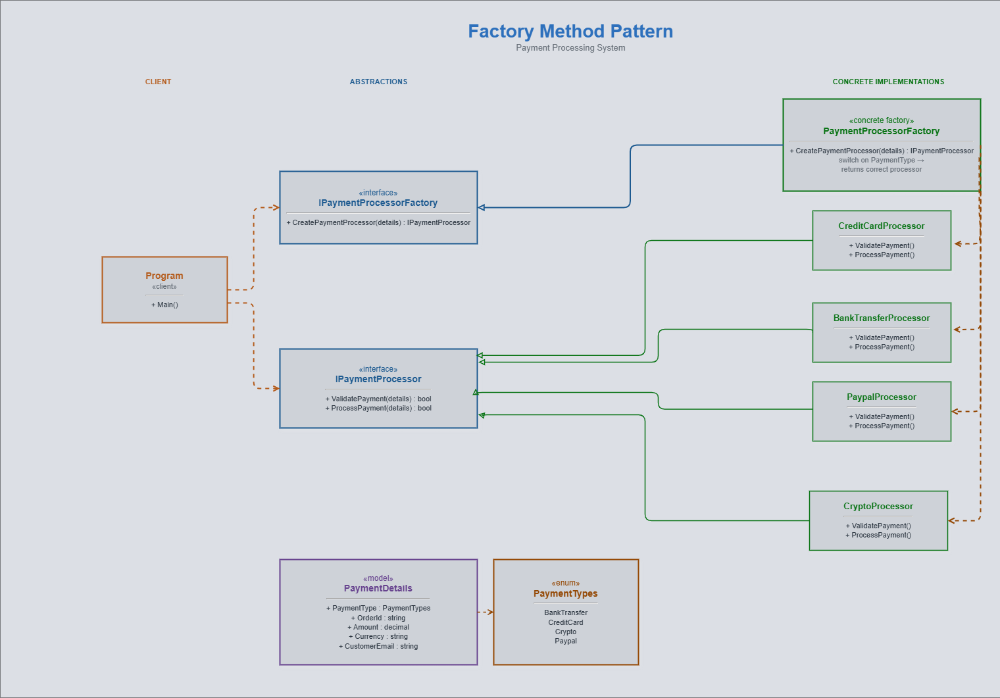

# Factory Method Pattern — Payment Processing

## What is the Factory Method Pattern?

The Factory Method pattern defines an interface for creating an object, but delegates the instantiation decision to a concrete factory. The client always works against abstractions — it never calls `new ConcreteType()` directly.

## Key Components

| Component | Class / Interface | Role |
|---|---|---|
| Product Interface | `IPaymentProcessor` | Contract all processors must implement |
| Factory Interface | `IPaymentProcessorFactory` | Declares the `CreatePaymentProcessor` factory method |
| Concrete Factory | `PaymentProcessorFactory` | Switches on `PaymentType` and returns the correct processor |
| Concrete Products | `CreditCardProcessor`, `PaypalProcessor`, `BankTransferProcessor`, `CryptoProcessor` | Real payment implementations |
| Client | `Program` | Consumes only interfaces, unaware of concrete types |
| Input Model | `PaymentDetails` | Carries order/customer data passed to the factory |

